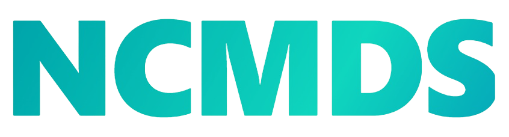
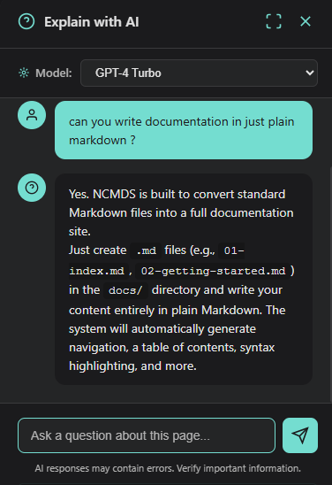

<div align="center">

# No Code Markdown Documentation Sites



**Create beautiful documentation sites with just Markdown**


</div>

## Overview

NCMDS is a zero-configuration documentation site builder that converts Markdown files into beautiful, dark-themed documentation websites with automatic navigation, AI-powered assistance, and an optimized reading experience.

**Author:** Eduardo J. Barrios ([edujbarrios](https://github.com/edujbarrios))

## ✨ Key Features

- 🤖 **AI-Powered Chat** - Ask questions about documentation content with built-in AI assistant
- 📤 **Export Functionality** - Export documentation to PDF and QMD (Quarto Markdown) formats
- 🎨 **Dark Theme** - Optimized for comfortable reading and coding
- 📱 **Responsive Design** - Works seamlessly on desktop and mobile
- 🔍 **Auto Navigation** - Automatic table of contents and page navigation

## 🚀 Quick Start

```bash
# Clone repository
git clone https://github.com/edujbarrios/ncmds.git
cd ncmds

# Install dependencies
pip install -r requirements.txt

# Run
python ncmds.py
```

Open `http://localhost:5000` in your browser.

## 📝 Usage

1. Add `.md` files to the `docs/` folder
2. Use numeric prefixes for ordering: `01-index.md`, `02-guide.md`
3. Write in Markdown
4. Reload browser to see changes

## ⚙️ Configuration

Edit `config/config.yaml`:

```yaml
site_name: "My Documentation"
author: "Your Name"
description: "Your site description"

hero:
  enabled: true
  project_name: "My Project"
  company: "Your Company"
  tagline: "Your tagline here"
  description: "Your project description"
```
### AI intergration

In the same `config/config.yaml`:

```yaml
ai_chat:
  enabled: true
  api_key: "your-api-key" # using LLM7.io
  model: "gpt-4o-mini"
```



## 📤 Export Documentation

NCMDS includes a powerful export module that allows you to export your documentation to different formats:

- **QMD Export** - Export to Quarto Markdown format for rendering with Quarto
- **Customizable Settings** - Configure project name, paper size, and more
- **Easy to Use** - Click floating export buttons on any documentation page

### Export Options

- Automatic table of contents generation
- Professional cover page with project branding
- Optimized for print and digital reading


## 📚 Documentation

Full documentation available at `/docs` when running the server, or view:

- [Getting Started](docs/02-getting-started.md)
- [Configuration Guide](docs/03-configuration.md)
- [Markdown Features](docs/04-markdown-guide.md)
- [Theme Creation](docs/05-themes.md)
- [Deployment Guide](docs/06-deployment.md)
- [Template Components](docs/07-components.md)

## 🛠️ Tech Stack

- **Flask** - Web framework
- **Python-Markdown** - Markdown processing
- **PyYAML** - Configuration
- **Highlight.js** - Syntax highlighting
- **LLM7.io** - AI chat integration
- **Quarto** - QMD rendering support (optional)

## 🎯 Use Cases

- Project documentation
- Technical documentation
- API documentation
- Personal wikis
- Educational materials
- User guides


## 🙏 Acknowledgments

Inspired by Docusaurus, MkDocs, Read the Docs, and Quarto.

## 📞 Contact

- **Author:** [edujbarrios](https://github.com/edujbarrios) - eduardojbarriosgarcia@gmail.com

